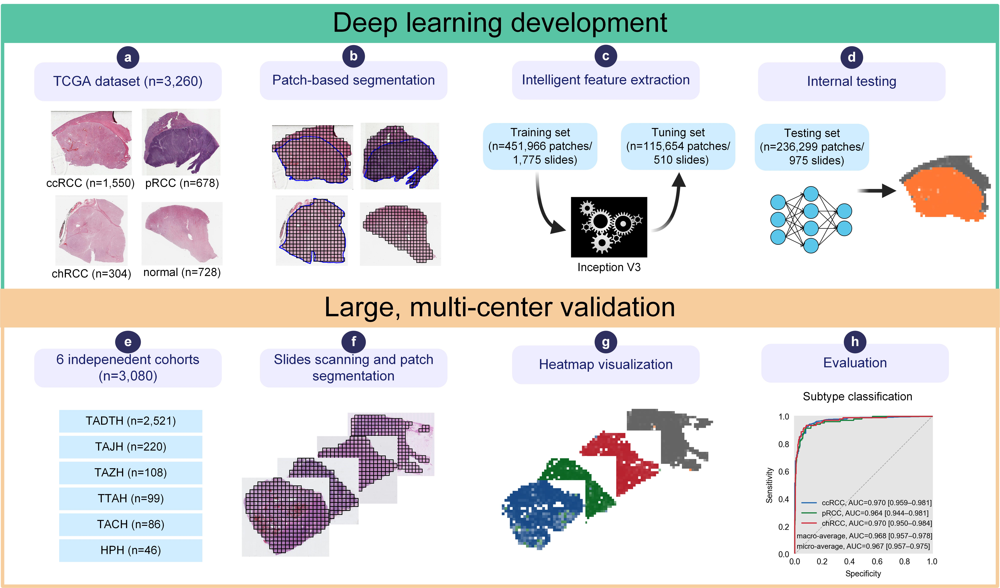
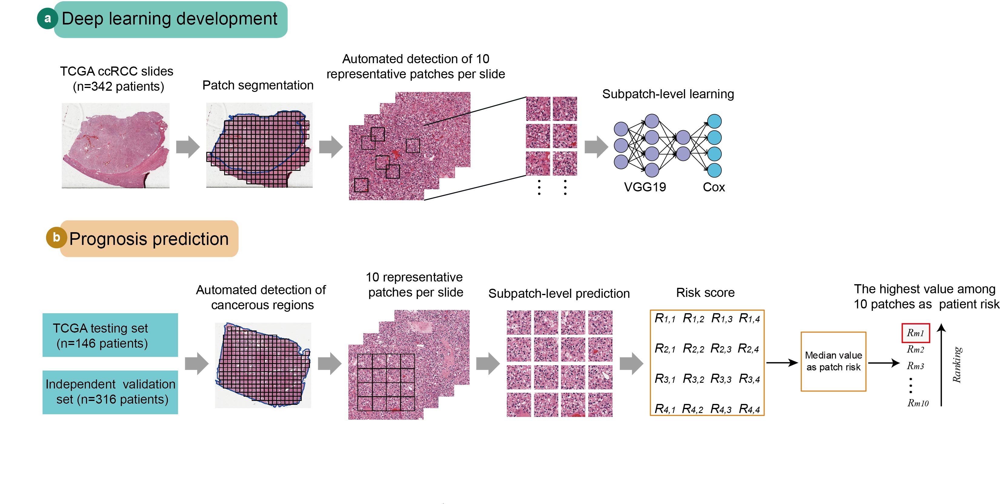

# Classifying subtypes and predicting survival of renal cell carcinoma using histopathology image-based deep learning

## Overview

Classifying histopathological subtypes and predicting survival of renal cell carcinoma (RCC) patients are critical steps towards treatment. We first proposed a deep learning method involving patch-based segmentation, intelligent feature extraction and heatmap visualization for classifying RCC into clear cell RCC, papillary RCC, chromophobe RCC, and adjacent benign tissue. This algorithm was trained and validated using 2,374,446 patches, 6,340 whole-slide images, 2,399 patients from The Cancer Genome Atlas and 6 independent centers. The classifiers provided an average AUC of 0.96 in the 6-center external phase. Furthermore, a modified deep learning approach comprising automated detection of regions of interest, patch-level learning, and morphological features-based risk scoring was developed for predicting survival of clear cell RCC patients. The risk index was an independent prognostic factor for overall survival which was validated in an external cohort. In conclusion, the developed histopathology image-based deep learning frameworks have the clinical potential in systematically evaluating RCC histological information.

Schematic presentation of the diagnostic system.


Pipeline of the prognostic framework.


## System requirements

### Hardware Requirements

```shell
NVIDIA GTX 1080Ti * 2
```

### OS Requirements

This package is supported for Linux. The package has been tested on the following systems:

```shell
Linux: Ubuntu 16.04
```

### Software Prerequisites

The whole project was built on Python 3.6, and the following softwares should be installed:

- OpenSlide
- CUDA 9.x and cudnn 7
- Python packages
  - tensorFlow-gpu 1.9.0
  - matplotlib 3.3.3
  - python-openslide 1.1.2
  - sklearn 0.23.2
  - numpy 1.16.0
  - pandas 1.1.5

## Installation guide

It is recommended to install the environment in the Ubuntu 16.04 system.

- Install Anconda3.
- Install Openslide
- Install CUDA 9.x and cudnn.
- Install these dependent python software library with the following command:

    ```shell
    pip install -r requirements.txt
    ```

## Demo

To run demo notebooks, use the following command to start jupyter notebook and open the url generated (like `http://localhost:8888/?token=fa307b55ad75d06b2454e8089a7173e7fa9edabc33100c5d`):

```shell
linux> jupyter notebook
```

### diagnosis

Normal vs Tumor:

- Open `diagnosis/diagnosis_test_tumor.ipynb`, click `Cell=>Run All` to run the demo.
- Expected run time: 60s

Kich vs Kirc vs Kirp:

- Open `diagnosis/diagnosis_test-subtype.ipynb`, click `Cell=>Run All` to run the demo.
- Expected run time: 60s

### prognosis

- Open `prognosis/prognosis_test.ipynb`, click `Cell=>Run All` to run the demo.
- Expected run time: 30s

The publicly shared RCC histopathology images in TCGA dataset to train and test the models is available at <https://portal.gdc.cancer.gov/>. The dataset consists of 3,260 whole-slide images from 941 patients, including 1,550 ccRCC, 678 pRCC, 304 chRCC, and 728 adjacent benign tissues. Demos that run the code/software in example data from testing.

## License

This project is covered under the **Apache 2.0 License**.
